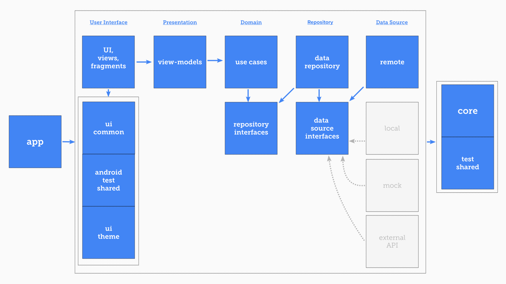

# Project Documentation

”Logic will get you from A to B. Imagination will take you everywhere.” - Albert Einstein

I implemented this project with a flexible and maintainable architectural design using Clean
architecture.

## Final product screenshots

* [Screenshot 1](docs/screenshot_1.png)
* [Screenshot 2](docs/screenshot_2.png)
* [Screenshot 3](docs/screenshot_3.png)
* [Screenshot 4](docs/screenshot_4.png)

## Technologies And Tools:

Here is the list of all the dependencies I used to develop this project.

* 100% use Kotlin.
* AppCompat Activity and Compose, Jetpack Navigation, Material Theme, Coil image loader
* Kotlin Coroutines throughout threading and Flow for sequential programming
* MVI architecture pattern using Orbit MVI
* Hilt for dependency injection
* KoTest, Mockk, Unit/Ui tests to improve Testability, Robustness, Accuracy, Reliability
* Modular structure to achieve Portability, Maintainability, Scalability, Usability, Team Work
* CMake native libraries to improve security by storing the Username and password in a more secure
  place
* KTS, a flavor of the Kotlin language used by Gradle in build configuration files
* Different Build Types as Develop, Release, and Staging using KTS configurations to improve
  Software
* Professional Error Handling using Result pattern and layered mappers on the user side, and Timber
  for better error reporting on the developer side
* Retrofit for the API communications and a Mock API to represent dummy data in the staging mode

## Modular System Design:

Using clean architecture would be fine for medium and large-size applications. I could use simpler
designs but I supposed that this app might have a large number of visitors and developers in the
future. For the simplicity and understandability of the project I diagrammed it out and you can see
the relations between different modules.

## Modules responsibilities:

* app: An orchestra module that has access to all modules to organize dependency injection.
* base:core: Some utils that can be used on the whole of the app's structure.
* base:test-shared: Defined utils for unit tests that can be implemented in every needed module
* base:orbit-utils: Added new features to handle MVI design pattern instead of MVVM+ for better
  testability
* base-ui:ui-common: Common utilities for the UI layers.
* base-ui:android-test-shared: Defined utils for android tests that can be implemented in every
  android module
* base-ui:ui-theme: Theme, styles, colors, dimensions, and other theme-related
* feature:sample:ui: Implemented Xml designs and UI controllers.
* feature:sample:presentation: A non-ui-related middleman to organize UI events and side effects
  with communications with the domain layer and map their results as a view state.
* domain:contract: An interface layer for the domain layer to communicate with the repository layer.
* domain:use-case: Implementation of business layer logic.
* data:contract: An interface layer for the data layer to communicate with the data-source layer
* data:repository: Implementations of the repository layer.
* datasource:remote: API implementation for taking responsibility for how data are coming from by
  exposing some real or mock data module.

## Advantages:

* Refactoring: You can refactor the UI layer and migrate to the Classic view system without changing
  even one line of the non-ui-related dependencies
* Flexibility: Changing theme and Ui libraries is a fairly straightforward assignment and it doesn't
  affect the top layers.
* Reus-ability: Make every single module a third-party library to use in the other projects
* Testability: You can separate your dependencies in various modules to make sure about dependency
  cyclic and dependency inversion
* Responsibility: Each layer is responsible for its own mission
* Build speed: If you change something in your base layers and it doesn't affect the modules tree,
  the derived modules shouldn't be recompiled due to using an interface layer between modules.

## Challenges

* I had to create lots of mappers and layers which is really picky for every single developer and my
  solution is developing a Meta-programming strategy to generate some pieces of code automatically.
* Implementing UI tests with espresso would be a complicated task, I strongly wanted to use compose
  but I know I have to adapt myself to legacy architectures which are now quite common in the
  android software development industries.
* If I have more time I try to add some features like Code Quality Measuring tools, Implementing
  CI/CD configurations, Test Coverage Measuring, and some automatic utils to detect lints error and
  certainly, improve test coverage, Auto publish using Fastlane or Jenkins with using taking
  screenshots from the staging mode with its own dummy data.